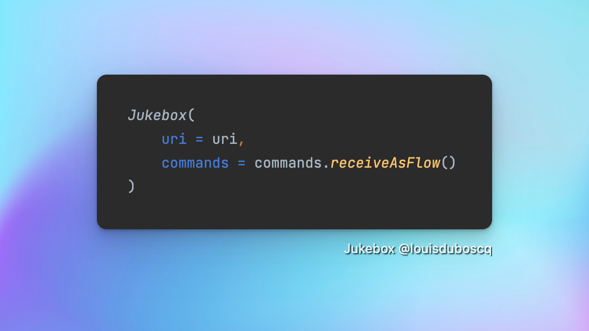
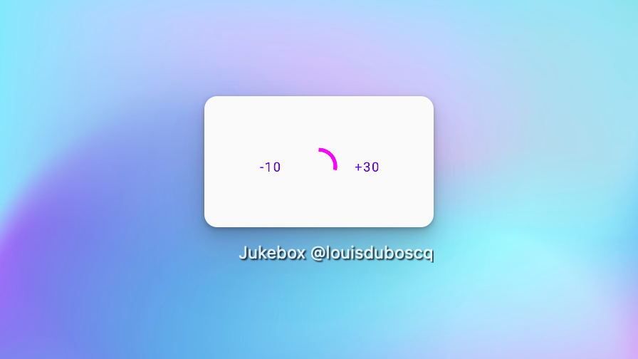

# What is Jukebox

A lighweight android library that helps you focusing on your audio UI and manages independently 
media player under the hood.

It’s built on top of jetpack compose and media player.

The focus is on flexibility to change loading, error and audio views.

# Setup

## 1 Gradle dependencies

```
// Add Maven Central to your repositories if needed
repositories {
    mavenCentral()
}
```

```
implementation "com.lduboscq.jukebox:$jukebox_version"
```

## Initialization 

### You use Koin

Load the jukebox module

```
    initKoin {
        modules(appModule, jukeboxModule)
    } 
```

### You do not use Koin

TODO

# What can I do with Jukebox

## Launch the Jukebox composable with the minimal parameters and get ready to use slider and audio player.




## Customize audio view : 




## Customize loading view : 

TODO

## Customize error view :

TODO

## Call play and pause, the commands understood by Jukebox


